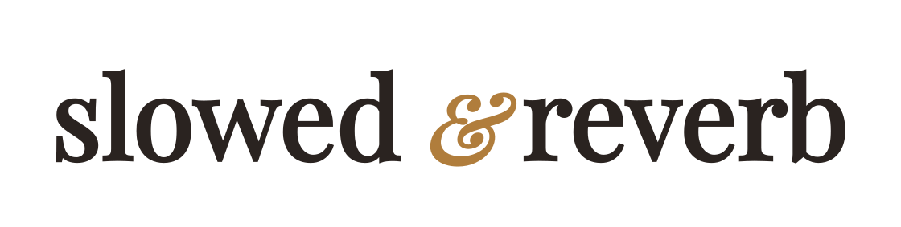
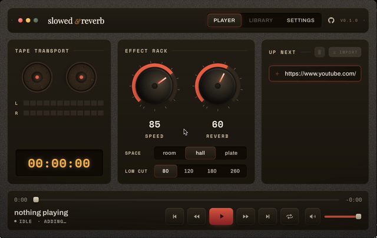

<p align="center">
  <a href="https://github.com/truehhart/slowed-and-reverb/releases"><picture>
    <source media="(prefers-color-scheme: dark)" srcset="public/brand-text-light.svg" />
    
  </picture></a>
</p>

<p align="center"><i>"Literally everything sounds better Slowed and Reverb."</i> (c) Me</p>

<p align="center">
  <a href="https://github.com/truehhart/slowed-and-reverb/releases"></a>
  <a href="LICENSE"></a>
  
</p>

---

Did you ever want to listen to a song but just couldn't find the slowed and reverb version of it? Or was there this new album drop that you needed slowed and reverb version of straight away? Well, use this bad boy - paste a YouTube link and it plays back **slowed down and with reverb**. Crazy stuff.

Drop a URL, drag two knobs, listen - [smart people](https://github.com/yt-dlp/yt-dlp) made and maintain yt-dlp, [dumb people](https://github.com/truehhart) spend tokens to make a simple UI with slow+reverb functionality on top of it. It's free real estate!

## Features

- **Video or playlist** — paste either; playlists queue up and auto-advance.
- **Speed** 0.5×–1× — slows the track and drops the pitch with it, exactly the slowed sound.
- **Reverb** 0–100% wet — pick the **space** (room / hall / plate) and a **low cut** to keep the tail clean.
- **Live queue** — add and import tracks on the fly; the now-playing title scrolls as a marquee.
- **Feels native on macOS** — media keys and the OS Now Playing controls just work.
- **Smart caching** — downloaded audio is cached for instant replays, with a storage gauge to keep it in check.
- **Self-contained** — `yt-dlp` ships inside the app; nothing else to install.

## Demo

<p align="center"></p>

## Install

macOS on Apple Silicon (arm64) only.

**Homebrew** (recommended):

```sh
brew tap truehhart/tap
brew trust truehhart/tap
brew install --cask slowed-and-reverb
```

**One-line install** (no Homebrew):

```sh
curl -fsSL https://raw.githubusercontent.com/truehhart/slowed-and-reverb/master/install.sh | sh
```

<details>
<summary><b>Manual <code>.dmg</code> install</b></summary>

Grab the `.dmg` from the [latest release](https://github.com/truehhart/slowed-and-reverb/releases), open it, and drag the app into **Applications**.

Builds aren't notarized, so a browser-downloaded `.dmg` is flagged by Gatekeeper and the app won't open. Clear the flag once:

```sh
xattr -dr com.apple.quarantine "/Applications/Slowed and Reverb.app"
```

</details>

## Build from source

Needs [mise](https://mise.jdx.dev) — it pins the whole toolchain (Rust, Node, pnpm, yt-dlp, Nushell).

```sh
mise install      # install the toolchain
pnpm install      # install JS deps (once, after mise install)
mise run dev      # run with hot reload
mise run build    # build the .app + .dmg bundle
```

`mise run build` drops the bundle under `src-tauri/target/release/bundle/`. Always go through **mise** — never raw `cargo` / `pnpm tauri`. Other tasks: `mise run check` (pre-commit gate), `mise run test`, `mise run fmt`.
